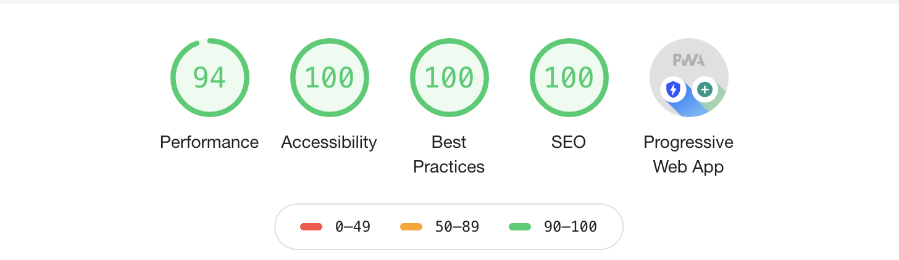

# Personal Website for Bryce Shaw

This is the repo for [my personal website](https://bryceshaw.com)... Check it out! 

It's still a work-in-progress but it's now a passable starting point :). So far, it's a **very** direct descendant from the excellent template [gatsby-starter-mate](https://github.com/EmaSuriano/gatsby-starter-mate), but it should start to diverge from there as I learn how frontend development works :). 

## Features 🛠

- [Gatsby v2](https://www.gatsbyjs.org/)
- [Rebass 3.0 🎉](https://rebassjs.org/): styled component system
- [React Reveal](https://www.react-reveal.com/)
- Dynamic content from [Contentful](https://contentful.com), with build hooks to the Netlify build server
- Offline support
- PWA ready
- SEO
- Responsive design
- Icons from [font-awesome](https://fontawesome.com/)
- [Netlify](https://www.netlify.com) Deployment 
- Medium integration
- Social sharing (Facebook, Google, LinkedIn)
- Google Analytics integration
- End to End with Cypress:
  - A11y testing with [Axe](https://www.deque.com/axe/)
  - Visual Testing with [Percy](https://percy.io/)

### Lighthouse Score 💯

## License 📝

MIT.
